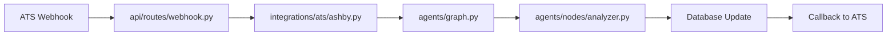

# Phase 1: Agentic Analysis MVP - Refined Implementation Plan

## Executive Summary

This document outlines a comprehensive migration plan from the current monolithic resume analysis backend to a scalable, agentic framework with a public Python SDK. The new architecture enables modular AI agents, third-party integrations, and future extensibility for voice interviewing (Phase 2) and production deployment (Phase 3).

---

## Table of Contents

1. [Current Architecture Analysis](#current-architecture-analysis)
2. [Refined Project Structure](#refined-project-structure)
3. [Missing Components](#missing-components)
4. [Phase 1 Implementation Roadmap](#phase-1-implementation-roadmap)
5. [Python SDK Architecture](#python-sdk-architecture)
6. [Integration Points](#integration-points)
7. [Testing Strategy](#testing-strategy)
8. [Migration Strategy](#migration-strategy)

---

## Current Architecture Analysis

### Strengths
- ✅ Well-organized service layer (LLM, scoring, matching)
- ✅ Proper authentication with JWT
- ✅ Pydantic models for type safety
- ✅ SSE streaming for real-time updates
- ✅ Supabase integration for auth, storage, and database

### Gaps for Agentic Framework
- ❌ No agent orchestration layer (LangGraph/CrewAI)
- ❌ No tool abstraction for agent actions
- ❌ No state management for multi-step agent workflows
- ❌ No public SDK for external integrations
- ❌ Missing integrations layer (Ashby, Lever, LinkedIn)
- ❌ No LLM observability (LangSmith)
- ❌ Tightly coupled services - difficult to compose agents

---

## Refined Project Structure

```
resalign-ai/
├── backend/
│   ├── api/
│   │   ├── __init__.py
│   │   ├── main.py                    # FastAPI app entry point
│   │   ├── config.py                  # Configuration management
│   │   ├── dependencies.py            # NEW: FastAPI dependency injection
│   │   │
│   │   ├── routes/
│   │   │   ├── __init__.py
│   │   │   ├── health.py
│   │   │   ├── upload.py
│   │   │   ├── extract.py
│   │   │   ├── analyze.py             # REFACTOR: Delegate to agent orchestrator
│   │   │   ├── webhook.py             # NEW: Webhooks for integrations
│   │   │   └── v1/                    # NEW: Versioned API routes
│   │   │       ├── __init__.py
│   │   │       ├── analyses.py        # CRUD for analyses
│   │   │       ├── resumes.py         # CRUD for resumes
│   │   │       └── jobs.py            # CRUD for job descriptions
│   │   │
│   │   ├── services/                  # EXISTING: Business logic services
│   │   │   ├── __init__.py
│   │   │   ├── llm_service.py         # KEEP: Gemini integration
│   │   │   ├── scorer.py              # REFACTOR: Convert to agent tool
│   │   │   ├── matcher.py             # REFACTOR: Convert to agent tool
│   │   │   ├── supabase.py            # KEEP: Database operations
│   │   │   ├── reducto.py             # KEEP: PDF processing
│   │   │   ├── fit_rationale_service.py
│   │   │   ├── resume_recommendation_service.py
│   │   │   ├── learning_resource_service.py
│   │   │   └── geval_service.py
│   │   │
│   │   ├── types/                     # EXISTING: Pydantic models
│   │   │   ├── __init__.py
│   │   │   ├── analysis.py
│   │   │   ├── extraction.py
│   │   │   ├── resume.py
│   │   │   ├── upload.py
│   │   │   └── agent.py               # NEW: Agent-specific types
│   │   │
│   │   ├── _utils/                    # EXISTING: Utilities
│   │   │   ├── __init__.py
│   │   │   ├── auth.py
│   │   │   ├── extraction_helpers.py
│   │   │   └── streaming.py           # NEW: SSE streaming helpers
│   │   │
│   │   └── middleware/                # NEW: Custom middleware
│   │       ├── __init__.py
│   │       ├── rate_limiting.py
│   │       ├── error_handling.py
│   │       └── request_logging.py
│   │
│   ├── agents/                        # NEW: Agent orchestration layer
│   │   ├── __init__.py
│   │   ├── base.py                    # Base agent class
│   │   ├── state.py                   # Agent state definitions (LangGraph)
│   │   ├── graph.py                   # LangGraph orchestration
│   │   │
│   │   ├── nodes/                     # Agent nodes (LangGraph nodes)
│   │   │   ├── __init__.py
│   │   │   ├── researcher.py          # Research agent
│   │   │   ├── analyzer.py            # Analysis coordinator
│   │   │   ├── scorer.py              # Scoring agent
│   │   │   ├── recommender.py         # Recommendation agent
│   │   │   └── interviewer.py         # Interview evaluator (Phase 2)
│   │   │
│   │   ├── tools/                     # Agent tools (actions agents can take)
│   │   │   ├── __init__.py
│   │   │   ├── base.py                # Base tool class
│   │   │   ├── scoring_tools.py       # Scoring tools
│   │   │   ├── matching_tools.py      # Skill matching tools
│   │   │   ├── research_tools.py      # Web research tools
│   │   │   ├── database_tools.py      # Database query tools
│   │   │   └── integration_tools.py   # ATS integration tools
│   │   │
│   │   └── prompts/                   # Agent system prompts
│   │       ├── __init__.py
│   │       ├── researcher.py
│   │       ├── analyzer.py
│   │       ├── scorer.py
│   │       └── recommender.py
│   │
│   ├── integrations/                  # NEW: Third-party integrations
│   │   ├── __init__.py
│   │   ├── base.py                    # Base integration class
│   │   ├── ats/                       # ATS integrations
│   │   │   ├── __init__.py
│   │   │   ├── ashby.py
│   │   │   ├── lever.py
│   │   │   └── greenhouse.py
│   │   ├── linkedin.py                # LinkedIn integration
│   │   ├── github.py                  # GitHub profile integration
│   │   └── voice/                     # Voice interview integrations (Phase 2)
│   │       ├── __init__.py
│   │       ├── elevenlabs.py
│   │       └── whisper.py
│   │
│   ├── core/                          # NEW: Core business domain logic
│   │   ├── __init__.py
│   │   ├── domain/                    # Domain models (business entities)
│   │   │   ├── __init__.py
│   │   │   ├── candidate.py           # Candidate domain model
│   │   │   ├── job.py                 # Job domain model
│   │   │   ├── analysis.py            # Analysis domain model
│   │   │   └── interview.py           # Interview domain model (Phase 2)
│   │   │
│   │   └── repositories/              # Repository pattern for data access
│   │       ├── __init__.py
│   │       ├── base.py
│   │       ├── candidate_repo.py
│   │       ├── job_repo.py
│   │       └── analysis_repo.py
│   │
│   ├── observability/                 # NEW: Monitoring and observability
│   │   ├── __init__.py
│   │   ├── langsmith.py               # LangSmith integration
│   │   ├── metrics.py                 # Prometheus metrics
│   │   └── tracing.py                 # Distributed tracing
│   │
│   ├── tests/
│   │   ├── __init__.py
│   │   ├── conftest.py                # Pytest fixtures
│   │   ├── unit/
│   │   │   ├── test_agents/
│   │   │   ├── test_services/
│   │   │   └── test_tools/
│   │   ├── integration/
│   │   │   ├── test_api/
│   │   │   ├── test_agents/
│   │   │   └── test_integrations/
│   │   └── e2e/
│   │       └── test_analysis_flow.py
│   │
│   ├── migrations/                    # Database migrations
│   │   └── supabase/
│   │
│   ├── scripts/                       # Utility scripts
│   │   ├── seed_data.py
│   │   ├── migrate.py
│   │   └── benchmark.py
│   │
│   ├── requirements.txt               # EXISTING
│   ├── requirements-dev.txt           # NEW: Dev dependencies
│   ├── pyproject.toml                 # NEW: Project metadata for SDK
│   ├── setup.py                       # NEW: For SDK distribution
│   ├── pytest.ini                     # NEW: Pytest configuration
│   └── .env.example                   # NEW: Environment template
│
├── sdk/                               # NEW: Public Python SDK
│   ├── resalign/
│   │   ├── __init__.py
│   │   ├── client.py                  # Main SDK client
│   │   ├── auth.py                    # Authentication
│   │   ├── exceptions.py              # SDK exceptions
│   │   │
│   │   ├── resources/                 # Resource endpoints
│   │   │   ├── __init__.py
│   │   │   ├── analyses.py
│   │   │   ├── resumes.py
│   │   │   ├── jobs.py
│   │   │   └── integrations.py
│   │   │
│   │   ├── types/                     # SDK types (subset of API types)
│   │   │   ├── __init__.py
│   │   │   ├── analysis.py
│   │   │   ├── resume.py
│   │   │   └── job.py
│   │   │
│   │   └── streaming/                 # SSE streaming support
│   │       ├── __init__.py
│   │       └── client.py
│   │
│   ├── examples/                      # SDK usage examples
│   │   ├── basic_analysis.py
│   │   ├── batch_processing.py
│   │   └── integration_example.py
│   │
│   ├── tests/
│   │   └── test_sdk.py
│   │
│   ├── README.md                      # SDK documentation
│   ├── pyproject.toml                 # SDK package config
│   └── setup.py                       # SDK installation
│
├── frontend/                          # EXISTING: React frontend
│   ├── src/
│   │   ├── api/                       # NEW: Typed API client using SDK
│   │   │   ├── client.ts
│   │   │   └── types.ts
│   │   ├── components/
│   │   ├── pages/
│   │   ├── hooks/
│   │   └── lib/
│   └── package.json
│
├── docs/                              # Enhanced documentation
│   ├── api/
│   │   ├── README.md
│   │   ├── authentication.md
│   │   ├── endpoints.md
│   │   └── webhooks.md
│   ├── sdk/
│   │   ├── quickstart.md
│   │   ├── reference.md
│   │   └── examples.md
│   ├── agents/
│   │   ├── architecture.md
│   │   ├── creating_agents.md
│   │   └── tools.md
│   ├── integrations/
│   │   ├── ashby.md
│   │   ├── lever.md
│   │   └── custom.md
│   └── deployment/
│       ├── gcp.md
│       ├── monitoring.md
│       └── scaling.md
│
├── .github/
│   └── workflows/
│       ├── backend-ci.yml
│       ├── frontend-ci.yml
│       ├── sdk-publish.yml
│       └── deploy.yml
│
├── docker/                            # Docker configurations
│   ├── backend.Dockerfile
│   ├── frontend.Dockerfile
│   └── docker-compose.yml
│
├── IMPLEMENTATION_ROADMAP.md          # EXISTING: High-level roadmap
├── PHASE_1_AGENTIC_IMPLEMENTATION_PLAN.md  # THIS FILE
├── README.md                          # EXISTING: Updated with SDK info
└── LICENSE
```

---

## Missing Components

### 1. Agent Orchestration Layer (`agents/`)
**Priority**: 🔴 Critical

**Components**:
- `agents/base.py` - Base agent class with common functionality
- `agents/state.py` - LangGraph state definitions for agent workflows
- `agents/graph.py` - LangGraph graph builder for agent orchestration
- `agents/nodes/` - Individual agent nodes (researcher, analyzer, scorer, recommender)
- `agents/tools/` - Tools agents can use (scoring, matching, research, database)
- `agents/prompts/` - System prompts for each agent type

**Why**: Current architecture lacks agent abstraction and orchestration. Services are tightly coupled and difficult to compose into multi-step workflows.

### 2. Public Python SDK (`sdk/`)
**Priority**: 🔴 Critical

**Components**:
- `sdk/resalign/client.py` - Main SDK client with authentication
- `sdk/resalign/resources/` - Resource-based API endpoints (analyses, resumes, jobs)
- `sdk/resalign/streaming/` - SSE streaming client
- `sdk/resalign/types/` - Typed models for SDK consumers
- `sdk/examples/` - Example scripts showing SDK usage
- `pyproject.toml` & `setup.py` - Package configuration for PyPI distribution

**Why**: Enable external integrations, third-party developers, and future SaaS offerings.

### 3. Integrations Layer (`integrations/`)
**Priority**: 🟡 High

**Components**:
- `integrations/base.py` - Base integration class with auth, rate limiting, retry logic
- `integrations/ats/ashby.py` - Ashby ATS integration
- `integrations/ats/lever.py` - Lever ATS integration
- `integrations/ats/greenhouse.py` - Greenhouse ATS integration
- `integrations/linkedin.py` - LinkedIn profile data extraction
- `integrations/github.py` - GitHub contribution analysis

**Why**: Enable seamless ATS integrations and external data enrichment.

### 4. Observability Layer (`observability/`)
**Priority**: 🟡 High

**Components**:
- `observability/langsmith.py` - LangSmith integration for LLM tracing
- `observability/metrics.py` - Prometheus metrics collection
- `observability/tracing.py` - Distributed tracing (OpenTelemetry)

**Why**: Production-ready observability for debugging, performance monitoring, and cost tracking.

### 5. Core Domain Layer (`core/`)
**Priority**: 🟢 Medium

**Components**:
- `core/domain/` - Domain models representing business entities
- `core/repositories/` - Repository pattern for clean data access layer

**Why**: Decouple business logic from infrastructure concerns (database, API framework).

### 6. Enhanced Testing (`tests/`)
**Priority**: 🟡 High

**Components**:
- `tests/unit/test_agents/` - Unit tests for agents
- `tests/unit/test_tools/` - Unit tests for agent tools
- `tests/integration/test_agents/` - Integration tests for agent workflows
- `tests/integration/test_integrations/` - Integration tests for third-party APIs
- `tests/e2e/` - End-to-end workflow tests

**Why**: Ensure reliability as complexity grows with agents and integrations.

### 7. API Versioning & Middleware (`api/v1/`, `api/middleware/`)
**Priority**: 🟢 Medium

**Components**:
- `api/v1/` - Versioned API routes
- `api/middleware/rate_limiting.py` - Rate limiting for public SDK
- `api/middleware/error_handling.py` - Consistent error responses
- `api/middleware/request_logging.py` - Request/response logging

**Why**: Maintain backward compatibility and production-grade API management.

### 8. Database Migrations (`migrations/`)
**Priority**: 🟢 Medium

**Components**:
- `migrations/supabase/` - SQL migration files for schema changes

**Why**: Version control for database schema as agents require new tables.

### 9. Deployment Configuration (`docker/`, `.github/workflows/`)
**Priority**: 🟡 High

**Components**:
- `docker/backend.Dockerfile` - Backend container
- `docker/frontend.Dockerfile` - Frontend container
- `docker/docker-compose.yml` - Local development environment
- `.github/workflows/backend-ci.yml` - Backend CI/CD pipeline
- `.github/workflows/sdk-publish.yml` - Automated SDK publishing to PyPI

**Why**: Streamline deployment and enable CI/CD for GCP Cloud Run (Phase 3).

---

## Phase 1 Implementation Roadmap

### Week 1-2: Foundation & Agent Infrastructure
**Goal**: Set up agent orchestration layer and core infrastructure

#### Tasks:
1. **Install LangGraph & Dependencies**
   ```bash
   pip install langgraph langsmith opentelemetry-api opentelemetry-sdk
   ```

2. **Create Agent Base Classes**
   - [ ] `agents/base.py` - Base agent with LLM client, tools, state
   - [ ] `agents/state.py` - Define `AgentState` with TypedDict
   - [ ] `agents/tools/base.py` - Base tool class
   - [ ] `agents/prompts/__init__.py` - Prompt templates

3. **Migrate Services to Agent Tools**
   - [ ] `agents/tools/scoring_tools.py` - Wrap `scorer.py` as tool
   - [ ] `agents/tools/matching_tools.py` - Wrap `matcher.py` as tool
   - [ ] `agents/tools/research_tools.py` - Web research tool
   - [ ] `agents/tools/database_tools.py` - Database query tool

4. **Create Agent Nodes**
   - [ ] `agents/nodes/researcher.py` - Research job market data
   - [ ] `agents/nodes/analyzer.py` - Coordinate analysis workflow
   - [ ] `agents/nodes/scorer.py` - Score resume vs. JD
   - [ ] `agents/nodes/recommender.py` - Generate recommendations

5. **Build LangGraph Orchestration**
   - [ ] `agents/graph.py` - Define analysis workflow graph
   - [ ] Add conditional edges (if score > 70, skip research)
   - [ ] Implement state checkpointing for resume/retry

6. **Integrate LangSmith**
   - [ ] `observability/langsmith.py` - Set up tracing
   - [ ] Add `@traceable` decorators to agents and tools
   - [ ] Configure environment variables (LANGSMITH_API_KEY, LANGSMITH_PROJECT)

**Deliverable**: Working agent-based analysis flow that matches current functionality.

---

### Week 3-4: Python SDK Development
**Goal**: Create public SDK for external integrations

#### Tasks:
1. **SDK Core Setup**
   - [ ] Create `sdk/resalign/` package structure
   - [ ] `sdk/resalign/client.py` - Main SDK client
   - [ ] `sdk/resalign/auth.py` - JWT authentication
   - [ ] `sdk/resalign/exceptions.py` - Custom SDK exceptions

2. **Resource Endpoints**
   - [ ] `sdk/resalign/resources/analyses.py` - Analysis CRUD
   - [ ] `sdk/resalign/resources/resumes.py` - Resume upload/management
   - [ ] `sdk/resalign/resources/jobs.py` - Job description management

3. **Streaming Support**
   - [ ] `sdk/resalign/streaming/client.py` - SSE streaming client
   - [ ] Handle connection management, reconnection logic
   - [ ] Parse SSE events into Python objects

4. **SDK Types**
   - [ ] `sdk/resalign/types/` - Copy relevant types from `backend/api/types/`
   - [ ] Ensure JSON serialization compatibility

5. **Examples & Documentation**
   - [ ] `sdk/examples/basic_analysis.py` - Simple usage example
   - [ ] `sdk/examples/batch_processing.py` - Batch analysis example
   - [ ] `sdk/README.md` - Quickstart and API reference

6. **Package Configuration**
   - [ ] `sdk/pyproject.toml` - Package metadata, dependencies
   - [ ] `sdk/setup.py` - Distribution configuration
   - [ ] `sdk/tests/test_sdk.py` - SDK unit tests

7. **Publishing Setup**
   - [ ] Test PyPI upload (test.pypi.org)
   - [ ] Create GitHub Action for automated publishing
   - [ ] Semantic versioning strategy

**Deliverable**: Published `resalign` SDK on PyPI with comprehensive documentation.

---

### Week 5-6: ATS Integrations
**Goal**: Enable ATS data ingestion (Ashby, Lever, Greenhouse)

#### Tasks:
1. **Integration Base Class**
   - [ ] `integrations/base.py` - Abstract integration class
   - [ ] Auth handling (OAuth2, API keys)
   - [ ] Rate limiting, retry logic with exponential backoff
   - [ ] Webhook signature verification

2. **Ashby Integration**
   - [ ] `integrations/ats/ashby.py` - Ashby API client
   - [ ] Fetch candidate data, applications, job postings
   - [ ] Map Ashby data to internal models
   - [ ] Webhook endpoint for real-time updates

3. **Lever Integration**
   - [ ] `integrations/ats/lever.py` - Lever API client
   - [ ] Fetch opportunities, candidates, stages
   - [ ] Map Lever data to internal models
   - [ ] Webhook endpoint

4. **Greenhouse Integration**
   - [ ] `integrations/ats/greenhouse.py` - Greenhouse API client
   - [ ] Fetch applications, candidates, job openings
   - [ ] Map Greenhouse data to internal models

5. **Agent Tool Integration**
   - [ ] `agents/tools/integration_tools.py` - ATS data fetching tools
   - [ ] Enable agents to pull real-time job market data

6. **API Webhook Endpoints**
   - [ ] `api/routes/webhook.py` - Webhook receiver
   - [ ] Route to appropriate integration handler
   - [ ] Trigger agent workflows on new candidate applications

**Deliverable**: Working ATS integrations with webhook support.

---

### Week 7-8: API Refinement & Testing
**Goal**: Enhance API with versioning, middleware, comprehensive testing

#### Tasks:
1. **API Versioning**
   - [ ] Create `api/v1/` directory
   - [ ] Move routes to versioned endpoints (`/api/v1/...`)
   - [ ] Maintain backward compatibility with current routes

2. **Middleware**
   - [ ] `api/middleware/rate_limiting.py` - Rate limiting (Redis/in-memory)
   - [ ] `api/middleware/error_handling.py` - Consistent error responses
   - [ ] `api/middleware/request_logging.py` - Request/response logging

3. **Enhanced Testing**
   - [ ] Unit tests for agents (`tests/unit/test_agents/`)
   - [ ] Unit tests for tools (`tests/unit/test_tools/`)
   - [ ] Integration tests for agent workflows (`tests/integration/test_agents/`)
   - [ ] Integration tests for ATS integrations (`tests/integration/test_integrations/`)
   - [ ] E2E test for full analysis flow (`tests/e2e/test_analysis_flow.py`)
   - [ ] Achieve >80% code coverage

4. **Documentation**
   - [ ] `docs/api/endpoints.md` - API endpoint documentation
   - [ ] `docs/api/authentication.md` - Auth flow documentation
   - [ ] `docs/api/webhooks.md` - Webhook setup guide
   - [ ] `docs/agents/architecture.md` - Agent architecture overview
   - [ ] `docs/agents/creating_agents.md` - Guide to adding new agents
   - [ ] `docs/integrations/` - Integration setup guides

5. **Refactor Current Routes**
   - [ ] `api/routes/analyze.py` - Delegate to agent orchestrator
   - [ ] Replace direct service calls with agent graph execution
   - [ ] Maintain SSE streaming interface

**Deliverable**: Production-ready API with comprehensive testing and documentation.

---

### Week 9-10: Observability & Deployment Prep
**Goal**: Set up monitoring, metrics, and deployment infrastructure

#### Tasks:
1. **LangSmith Integration**
   - [ ] Complete tracing setup for all agents and tools
   - [ ] Create custom LangSmith runs for analysis workflows
   - [ ] Set up dashboards in LangSmith UI

2. **Metrics & Monitoring**
   - [ ] `observability/metrics.py` - Prometheus metrics (request count, latency, errors)
   - [ ] Export metrics endpoint (`/metrics`)
   - [ ] Set up Grafana dashboards (optional for Phase 1)

3. **Docker Configuration**
   - [ ] `docker/backend.Dockerfile` - Multi-stage build
   - [ ] `docker/frontend.Dockerfile` - Production build
   - [ ] `docker/docker-compose.yml` - Local development environment
   - [ ] Test Docker builds locally

4. **CI/CD Pipelines**
   - [ ] `.github/workflows/backend-ci.yml` - Run tests, lint, type check
   - [ ] `.github/workflows/frontend-ci.yml` - Build and test frontend
   - [ ] `.github/workflows/sdk-publish.yml` - Publish SDK to PyPI on release
   - [ ] `.github/workflows/deploy.yml` - Deploy to staging environment

5. **Database Migrations**
   - [ ] Set up Supabase migration workflow
   - [ ] Create initial migration for agent state tables
   - [ ] Document migration process

6. **Environment Configuration**
   - [ ] `.env.example` - Template with all required variables
   - [ ] Document all environment variables in `README.md`
   - [ ] Set up environment-specific configs (dev, staging, prod)

**Deliverable**: Observability, monitoring, and deployment infrastructure ready for Phase 3.

---

## Python SDK Architecture

### Design Principles
1. **Resource-Oriented**: Organize API endpoints by resources (analyses, resumes, jobs)
2. **Type-Safe**: Use Pydantic models for request/response validation
3. **Streaming-First**: Built-in support for SSE streaming
4. **Async-Ready**: Support both sync and async usage patterns
5. **Error Handling**: Clear, actionable error messages
6. **Extensible**: Easy to add new resources and methods

### SDK Structure

```python
# sdk/resalign/__init__.py
from .client import ResAlignClient
from .exceptions import ResAlignError, AuthenticationError, ValidationError

__version__ = "0.1.0"
__all__ = ["ResAlignClient", "ResAlignError", "AuthenticationError", "ValidationError"]
```

```python
# sdk/resalign/client.py
from typing import Optional
from .auth import Auth
from .resources import Analyses, Resumes, Jobs
from .streaming import StreamingClient

class ResAlignClient:
    """
    Main entry point for ResAlign AI SDK.
    
    Example:
        >>> from resalign import ResAlignClient
        >>> client = ResAlignClient(api_key="your_api_key")
        >>> analysis = client.analyses.create(resume_id="...", jd_id="...")
    """
    
    def __init__(
        self,
        api_key: Optional[str] = None,
        base_url: str = "https://api.resalign.ai",
        timeout: int = 30
    ):
        self.auth = Auth(api_key=api_key)
        self.base_url = base_url
        self.timeout = timeout
        
        # Resource endpoints
        self.analyses = Analyses(self)
        self.resumes = Resumes(self)
        self.jobs = Jobs(self)
        self.streaming = StreamingClient(self)
```

```python
# sdk/resalign/resources/analyses.py
from typing import Optional, Dict, Any, Iterator
from ..types import Analysis

class Analyses:
    """Analyses resource endpoint."""
    
    def __init__(self, client):
        self._client = client
    
    def create(
        self,
        resume_id: str,
        jd_id: str,
        stream: bool = False
    ) -> Analysis | Iterator[Dict[str, Any]]:
        """
        Create a new analysis.
        
        Args:
            resume_id: UUID of the resume
            jd_id: UUID of the job description
            stream: If True, returns SSE event iterator
        
        Returns:
            Analysis object or SSE event iterator if streaming
        """
        if stream:
            return self._client.streaming.stream_analysis(resume_id, jd_id)
        
        response = self._client._request(
            "POST",
            "/api/v1/analyses",
            json={"resume_id": resume_id, "jd_id": jd_id}
        )
        return Analysis(**response)
    
    def get(self, analysis_id: str) -> Analysis:
        """Retrieve an analysis by ID."""
        response = self._client._request("GET", f"/api/v1/analyses/{analysis_id}")
        return Analysis(**response)
    
    def list(self, limit: int = 10, offset: int = 0) -> list[Analysis]:
        """List user's analyses."""
        response = self._client._request(
            "GET",
            "/api/v1/analyses",
            params={"limit": limit, "offset": offset}
        )
        return [Analysis(**item) for item in response["data"]]
```

```python
# sdk/resalign/streaming/client.py
import json
from typing import Iterator, Dict, Any
import httpx

class StreamingClient:
    """SSE streaming client for real-time analysis updates."""
    
    def __init__(self, client):
        self._client = client
    
    def stream_analysis(
        self,
        resume_id: str,
        jd_id: str
    ) -> Iterator[Dict[str, Any]]:
        """
        Stream analysis progress events.
        
        Yields:
            Dict with 'event' and 'data' keys for each SSE event
        """
        headers = self._client.auth.get_headers()
        url = f"{self._client.base_url}/api/v1/analyze"
        
        with httpx.stream(
            "POST",
            url,
            json={"resume_id": resume_id, "jd_id": jd_id},
            headers=headers,
            timeout=None
        ) as response:
            for line in response.iter_lines():
                if line.startswith("data: "):
                    data = line[6:]  # Remove "data: " prefix
                    if data == "[DONE]":
                        break
                    try:
                        yield json.loads(data)
                    except json.JSONDecodeError:
                        continue
```

### SDK Usage Examples

```python
# Example 1: Basic analysis (non-streaming)
from resalign import ResAlignClient

client = ResAlignClient(api_key="your_api_key")

# Upload resume
resume = client.resumes.upload("path/to/resume.pdf")

# Create job description
job = client.jobs.create(description="Software Engineer at TechCorp...")

# Run analysis
analysis = client.analyses.create(resume_id=resume.id, jd_id=job.id)

print(f"Overall Score: {analysis.overall_score}")
print(f"Fit: {analysis.fit_classification}")
```

```python
# Example 2: Streaming analysis with progress updates
from resalign import ResAlignClient

client = ResAlignClient(api_key="your_api_key")

for event in client.analyses.create(resume_id=resume_id, jd_id=jd_id, stream=True):
    if event["event"] == "progress":
        print(f"{event['data']['progress']}% - {event['data']['message']}")
    elif event["event"] == "complete":
        print(f"Final Score: {event['data']['overall_score']}")
        print(f"Recommendations: {event['data']['recommendations']}")
```

```python
# Example 3: Batch processing with async
import asyncio
from resalign import ResAlignClient

async def analyze_candidates(candidates):
    client = ResAlignClient(api_key="your_api_key")
    
    tasks = [
        client.analyses.create_async(resume_id=c.resume_id, jd_id=c.jd_id)
        for c in candidates
    ]
    
    results = await asyncio.gather(*tasks)
    return results

# Run batch analysis
results = asyncio.run(analyze_candidates(candidate_list))
```

---

## Integration Points

### 1. ATS Integration Flow



**Implementation**:
1. ATS sends webhook on new candidate application
2. Webhook endpoint receives data, verifies signature
3. Integration layer fetches full candidate data
4. Agent orchestrator triggers analysis workflow
5. Results stored in database
6. Callback sent to ATS with analysis summary

### 2. SDK → API Integration

```
SDK Client (resalign)
    ↓
API Gateway (FastAPI)
    ↓
Authentication Middleware
    ↓
Rate Limiting Middleware
    ↓
Request Logging
    ↓
Agent Orchestrator (agents/graph.py)
    ↓
Agent Nodes (researchers, scorers, recommenders)
    ↓
Tools (scoring, matching, research)
    ↓
Services (LLM, database, integrations)
    ↓
Database/External APIs
```

### 3. Agent Tool Architecture

```python
# agents/tools/base.py
from typing import Any, Dict, Optional
from pydantic import BaseModel

class ToolInput(BaseModel):
    """Base input model for tools."""
    pass

class ToolOutput(BaseModel):
    """Base output model for tools."""
    success: bool
    result: Any
    error: Optional[str] = None

class BaseTool:
    """Base class for agent tools."""
    
    name: str
    description: str
    input_schema: type[ToolInput]
    
    def run(self, input: ToolInput) -> ToolOutput:
        """Execute the tool."""
        raise NotImplementedError
    
    async def arun(self, input: ToolInput) -> ToolOutput:
        """Async execution of the tool."""
        raise NotImplementedError
```

```python
# agents/tools/scoring_tools.py
from .base import BaseTool, ToolInput, ToolOutput
from api.services.scorer import get_scoring_service

class ScoreResumeInput(ToolInput):
    resume: dict
    jd: dict

class ScoreResumeOutput(ToolOutput):
    result: dict  # {"overall_score": 85, "category_scores": {...}}

class ScoreResumeTool(BaseTool):
    """Tool for scoring resume against job description."""
    
    name = "score_resume"
    description = "Calculate compatibility score between resume and job description"
    input_schema = ScoreResumeInput
    
    def run(self, input: ScoreResumeInput) -> ScoreResumeOutput:
        scorer = get_scoring_service()
        scores = scorer.calculate_scores(input.resume, input.jd)
        return ScoreResumeOutput(success=True, result=scores)
```

---

## Testing Strategy

### 1. Unit Tests (70% Coverage Target)
- **Agent Nodes**: Mock LLM calls, test state transitions
- **Agent Tools**: Test tool logic in isolation
- **Services**: Existing service tests remain
- **SDK**: Test client methods, auth, error handling

### 2. Integration Tests (20% Coverage Target)
- **Agent Workflows**: Test full graph execution with real LLM calls (use test API keys)
- **ATS Integrations**: Test API client with mock HTTP responses (httpx.mock)
- **Database**: Test repository layer with test database
- **SDK → API**: Test SDK against local API instance

### 3. End-to-End Tests (10% Coverage Target)
- **Full Analysis Flow**: Upload resume → create JD → analyze → verify results
- **Webhook Flow**: Simulate ATS webhook → agent workflow → callback
- **Streaming**: Test SSE streaming from client to completion

### Test Infrastructure
```bash
# pytest.ini
[pytest]
asyncio_mode = auto
testpaths = tests
python_files = test_*.py
python_classes = Test*
python_functions = test_*
markers =
    unit: Unit tests
    integration: Integration tests
    e2e: End-to-end tests
    slow: Slow tests (LLM calls)
```

```bash
# Run tests
pytest tests/unit/                    # Fast unit tests
pytest tests/integration/ -m "not slow"  # Integration tests without LLM calls
pytest tests/e2e/                     # Full E2E tests
pytest --cov=api --cov-report=html    # Coverage report
```

---

## Migration Strategy

### Phase 1A: Parallel Development (Week 1-4)
**Goal**: Build agent layer alongside existing services

- ✅ Existing API continues to work
- ✅ Agent layer developed in parallel
- ✅ No breaking changes to frontend
- ✅ Gradual migration of services to tools

### Phase 1B: Feature Toggle (Week 5-6)
**Goal**: Enable agent-based analysis behind feature flag

```python
# api/config.py
USE_AGENT_ORCHESTRATION: bool = os.getenv("USE_AGENT_ORCHESTRATION", "False").lower() == "true"
```

```python
# api/routes/analyze.py
if settings.USE_AGENT_ORCHESTRATION:
    # Use new agent orchestrator
    result = await agent_graph.run(state)
else:
    # Use existing service layer
    result = await legacy_analysis_flow(resume, jd)
```

- ✅ Test agent flow in staging environment
- ✅ Compare results between old and new flows
- ✅ Gradual rollout to production users

### Phase 1C: Complete Migration (Week 7-8)
**Goal**: Fully migrate to agent orchestration

- ✅ Remove feature flag
- ✅ Delete legacy analysis code
- ✅ Update documentation
- ✅ Publish SDK v1.0

### Rollback Plan
- Keep legacy code in separate branch (`legacy/monolithic-analysis`)
- Feature flag allows instant rollback
- Database schema remains compatible
- Monitor error rates and performance metrics

---

## Success Metrics

### Technical Metrics
- ✅ SDK published to PyPI
- ✅ Agent orchestration passes all existing tests
- ✅ >80% code coverage maintained
- ✅ API response time < 10s for 95th percentile
- ✅ Zero downtime migration

### Business Metrics
- ✅ At least 1 external integration using SDK
- ✅ ATS integrations live for 2+ customers
- ✅ LangSmith observability providing actionable insights
- ✅ Agent workflows demonstrably more flexible than monolithic services

### Phase 2 Readiness
- ✅ Agent framework supports adding new nodes (voice interviewer)
- ✅ SDK supports streaming voice transcriptions
- ✅ Infrastructure can scale to handle real-time voice processing

---

## Next Steps

1. **Review & Approval**: Review this plan with team/stakeholders
2. **Environment Setup**: Set up LangSmith account, test PyPI account
3. **Week 1 Kickoff**: Begin with agent base classes and state definitions
4. **Weekly Check-ins**: Review progress, adjust timeline as needed
5. **Phase 2 Planning**: Begin voice interviewer architecture design (Week 8)

---

## Conclusion

This plan provides a comprehensive migration strategy to an agentic framework with a public SDK. The phased approach minimizes risk, maintains backward compatibility, and sets the foundation for Phase 2 (voice interviewing) and Phase 3 (production deployment).

**Key Advantages**:
- ✅ Modular, composable agents vs. monolithic services
- ✅ Public SDK enables external integrations and future SaaS offerings
- ✅ ATS integrations unlock enterprise customers
- ✅ Observability with LangSmith for production debugging
- ✅ Scalable architecture ready for GCP Cloud Run

**Timeline**: 10 weeks to complete Phase 1 with SDK and ATS integrations

**Resources Needed**:
- LangSmith account (free tier: 5K traces/month)
- Test PyPI account for SDK testing
- ATS API credentials (Ashby, Lever, Greenhouse)
- GCP account for Phase 3 ($2000 credits available)

Ready to begin implementation! 🚀

